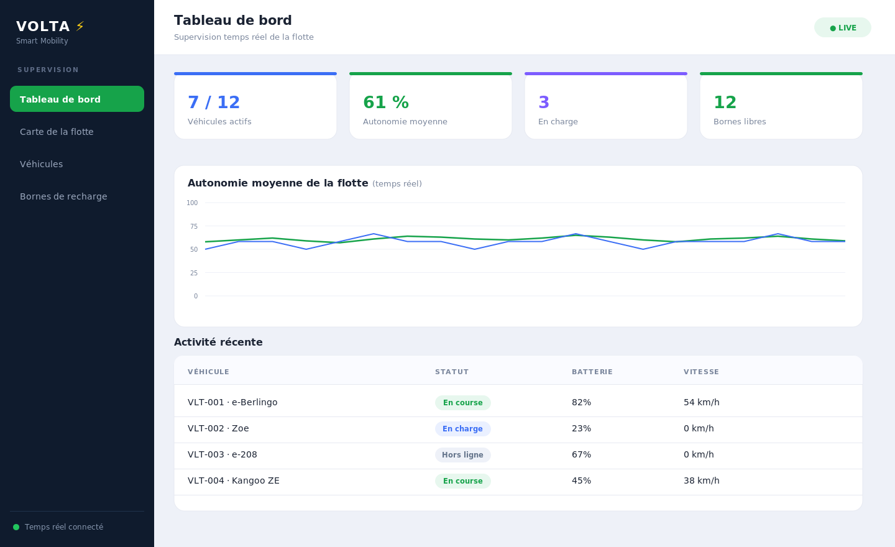
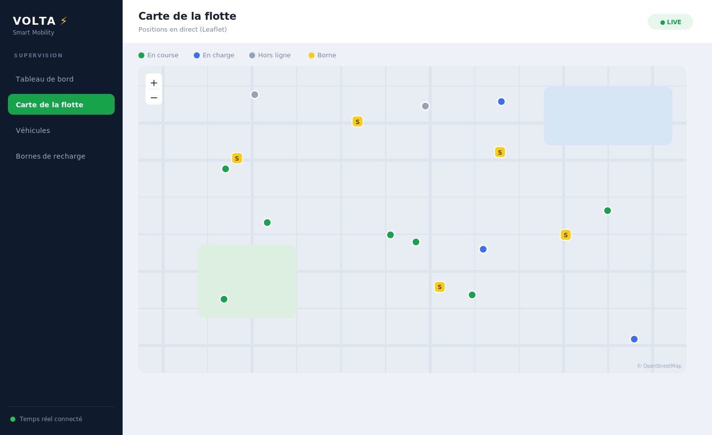
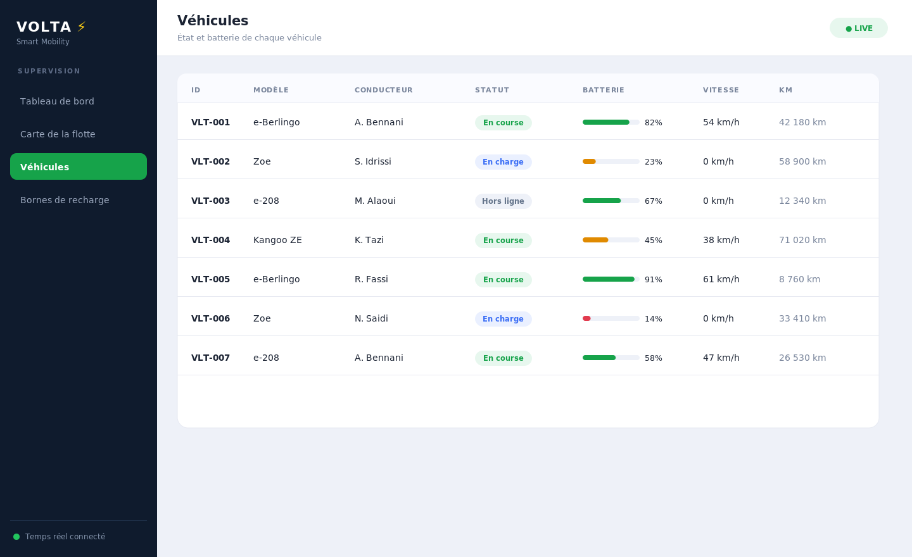
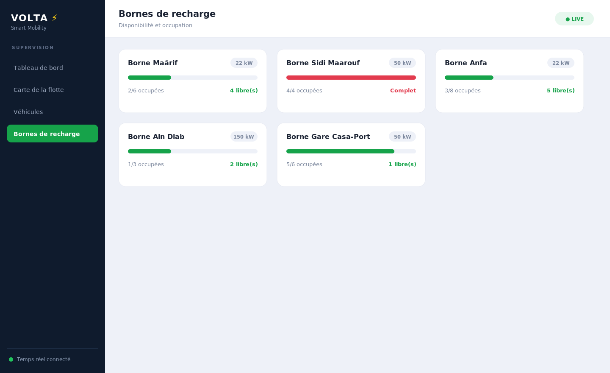

# VOLTA — Plateforme de mobilité urbaine intelligente

Supervision en **temps réel** d'une flotte de véhicules électriques et de bornes de recharge : carte interactive, tableaux de bord temps réel et visualisation de données. Frontend **React (Vite)** + backend **Node.js / Express** avec **WebSocket** et cartographie **Leaflet**.

> Projet personnel de Badr Chigar — Ingénieur d'État en Informatique (EMSI Casablanca), développeur Full Stack Java/Spring & React.

## Captures d'écran

### Tableau de bord temps réel


### Carte de la flotte (Leaflet)


### Véhicules


### Bornes de recharge


## Fonctionnalités
- **Temps réel** : positions, vitesse et batterie des véhicules poussées par **WebSocket** (mise à jour toutes les 2 s).
- **Carte interactive Leaflet** : marqueurs des véhicules et bornes, mise à jour live.
- **Tableaux de bord** : KPIs (véhicules actifs, autonomie moyenne, bornes libres) + graphique temps réel.
- **Flotte** : liste des véhicules avec statut (en course, en charge, hors-ligne) et niveau de batterie.
- **Bornes de recharge** : disponibilité, puissance, occupation.

## Stack
| Couche | Technologies |
|--------|--------------|
| Frontend | React 18, Vite, React Router, Leaflet, Recharts |
| Backend | Node.js, Express, WebSocket (`ws`) |
| Données | Simulateur de télémétrie temps réel |

## Architecture
```
volta/
├── server/        API REST + serveur WebSocket (simulateur de flotte)
│   ├── index.js
│   └── fleet.js   modèle de la flotte + simulation
└── client/        SPA React (Vite)
    └── src/
        ├── pages/        Dashboard, Carte, Vehicules, Stations
        └── components/   Layout, MapView (Leaflet), LiveChart
```

## Démarrage
### Backend (port 4001)
```bash
cd server && npm install && npm start
```
### Frontend (port 5173)
```bash
cd client && npm install && npm run dev
```
Ouvre http://localhost:5173 — la carte et les dashboards se mettent à jour en direct.

## Licence
MIT © Badr Chigar
